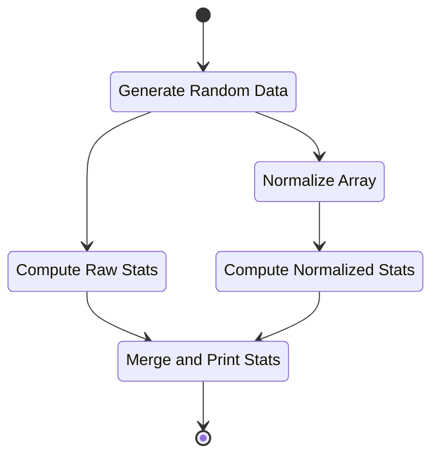
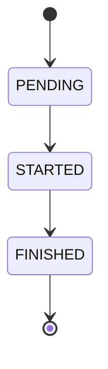

# Directed Acyclic Graph Executor

The project implements a Directed Acyclic Graph (DAG) executor in Python that enables the creation and execution of computational pipelines. It handles the dependencies between tasks (represented as nodes in a DAG) and ensures that tasks are executed only when all their required inputs are available. Each task can have one or more dependencies, and the system ensures that tasks are executed in the correct order. The pipeline is designed to handle both concurrent and parallel execution of tasks, allowing for efficient execution of tasks.

## Architecture:

### Task computation representation

Task dependencies are represented using a graph structure, where tasks are modeled as nodes and their dependencies as edges. This graph-based approach simplifies the visualization and management of complex workflows. To ensure the integrity of the computation, the system includes an acyclic check, preventing circular dependencies and ensuring that tasks are executed in a valid order. Example of computation pipeline could look as follows:



Each task in the system can exist in one of three states: **PENDING**, **STARTED**, or **FINISHED**. A task begins in the **PENDING** state, indicating it has been created but has not started executing yet. Once the task starts executing, it transitions to the **STARTED** state. After completing its execution and producing a result, the task transitions to the **FINISHED** state. These state transitions are automatically managed during the pipeline execution, ensuring that tasks begin only when their dependencies are met and finish only after their computation is complete.



### Responsibilities
**DAG Structure**: The `DirectAcyclicGraph` handling graph operations such as adding nodes and edges, checking for cycles, and getting input/output nodes. It's focused solely on representing the graph structure.

**Task Representation**: The `Task` class encapsulates the state and execution logic of individual tasks. Isolates the task behavior from the graph, allowing easier future modifications or extensions.

**Task Execution**: The `Executor` class is responsible for managing task execution asynchronously using `concurrent.futures.ProcessPoolExecutor`. This separation is excellent because it decouples execution from task definition and the DAG structure.

**Pipeline Control**: The `Pipeline` class manages the orchestration of tasks, checking for readiness and managing dependencies. This is a central place for coordinating task execution.

### Workflow

The Pipeline class orchestrates the entire workflow by managing the execution of tasks and their dependencies. It uses a graph structure to store tasks and define their relationships, ensuring tasks are executed in the correct order. Tasks are created by defining callable functions and added to the pipeline, where dependencies are set to guarantee that each task runs only when its required inputs, or results from other tasks, are available. The pipeline makes decisions based on the task states and the dependencies represented in structure of the graph, submitting tasks that are ready for execution and waiting for task progress. The Executor class handles the parallel execution of independent tasks and changes their states before and after execution. Using a thread pool, the executor ensures tasks that can run concurrently are handled efficiently, improving overall execution speed. Throughout the process, the pipeline ensures tasks respect their dependencies while the executor manages parallelism, creating an efficient and orderly workflow.

## API description

### 1. Define tasks
The tasks are defined as ordinary Python functions (e.g., `task_a`, `task_b` and `task_c`). These tasks represent individual steps that perform a unit of work. In this case, `task_a`, `task_b` return result, while `task_c` takes inputs from those tasks and process them.

```python
def task_a():
    return "Hello"

def task_b():
    return " ,World!"

def task_c(a, b):
    return f"{a}{b}"
```

### 2. Initialize Pipeline

A `pipeline` object is initialized. The pipeline is a central object that manages the execution flow of tasks and their dependencies.

```python
from pipeline import Pipeline

pipeline = Pipeline()
```

### 3. Creating Task

Tasks are created by calling the `create_task()` method of the `Pipeline` instance. This method takes a function (task) as an argument and creates a task object. These task objects are then used in the pipeline to define dependencies and execute them.


```python
a = pipeline.create_task(task_a)
b = pipeline.create_task(task_b)
c = pipeline.create_task(task_c)
```

### 4. Setting Task Dependencies:

The `set_dependency()` method is used to specify dependencies between tasks. In this example, task `c` depends on tasks `a` and `b`. This means that `task_c` will not run until `task_a` and `task_b` have finished their execution.

```python
pipeline.set_dependency(a, c)
pipeline.set_dependency(b, c)
```

### 5. Running the Pipeline:

The `run()` method of the pipeline is called to execute the tasks. The tasks will run according to their dependencies, ensuring that tasks `a` and `b` complete before `task_c` runs.

```python
pipeline.run()
```

### 6. Accessing Task Results:

After the pipeline has run, you can access the results of the tasks. In this case, `c.result()` will return the result of task `c`, which is the concatenation of the results from tasks `a` and `b`.

```python
print(c.get_result())  # Output: "Hello, World!"
```
 

## Installation and Usage

To get started with the **DAG Executor** package, follow these steps:

### 1. Installation

Download project from GitHub:
```bash
git clone https://github.com/3uky/dag-executor.git
cd dag-executor
```

Setup environment:
```bash
python -m venv .venv
source .venv/bin/activate
```

Install package from project root directory. This step download dependencies and set up basic configuration:
```bash
pip install .
```

### 2. Running Tests

```bash
pytest
```

### 3. Running Entry Task Example

For running assignment task example from `SW Entry Task.pdf` use following commands:
```bash
~/git/dag-executor/src$ python main.py 
raw min: 1
raw max: 9
raw mean: 5.333333333333333
raw std: 2.778888666755511
normalized min: 0.0
normalized max: 1.0
normalized mean: 0.5416666666666666
normalized std: 0.3473610833444389
````

Information about task state changes could be enabled with option `-v`:
```bash
~/git/dag-executor/src$ python main.py -v
2025-03-06 15:08:42,932 - Task generate_random_data STARTED
2025-03-06 15:08:42,932 - Task generate_random_data FINISHED
2025-03-06 15:08:42,932 - Task compute_raw_stats STARTED
2025-03-06 15:08:42,932 - Task normalize_array STARTED
2025-03-06 15:08:42,933 - Task normalize_array FINISHED
2025-03-06 15:08:42,933 - Task compute_raw_stats FINISHED
2025-03-06 15:08:42,933 - Task compute_normalized_stats STARTED
2025-03-06 15:08:42,934 - Task compute_normalized_stats FINISHED
2025-03-06 15:08:42,934 - Task merge_and_print_stats STARTED
...
```

For display task inputs and outputs during partial computation use higher level of verbosity `-vv`: 

```bash
~/git/dag-executor/src$ python main.py -vv
2025-03-06 15:08:47,491 - Task generate_random_data STARTED
2025-03-06 15:08:47,491 - Task generate_random_data inputs:
()
2025-03-06 15:08:47,492 - Task generate_random_data outputs:
[[3 6 4 2]
 [5 3 9 8]
 [3 4 3 9]]
 ...
```

## Tests
### Unit Test Description

- **test_dag.py**: Validates the functionality of adding/removing nodes and edges and ensures the graph remains acyclic.
- **test_executor.py**: Verifies the correct submission, execution, and parallel execution of tasks within the executor.
- **test_pipeline.py**: Tests task creation, dependency handling, and correct execution flow in the pipeline.
- **test_task.py**: Ensures task state transitions and correct execution with or without arguments.
- **test_performance.py**: Demonstrates the performance improvement of parallel task execution using pipeline compared to sequential execution.

### System Test Description

- **test_system.py**: Ensures whole pipeline execution, data propagation, and synchronization across tasks.
- **test_entry_task.py**: Automated evaluation of entry task from `SW Entry Tasks.pdf`.

## Benefits of the Solution:

- **Data-Driven Execution:** Tasks are executed based on data availability, not in a fixed order. This ensures that computation respects task dependencies.
- **Concurrency:** By leveraging concurrent execution, the solution optimizes for performance by running independent tasks in parallel.
- **Modularity:** The modular design of separating concerns into different classes (DAG, Task, Executor, Pipeline) helps keep the system maintainable. Each class has a single responsibility, which simplifies testing and debugging.
- **Scalability:** The design can scale to handle larger and more complex computational pipelines by adding new task types or optimizing the graph traversal and execution strategies.

## Conclusion:

This solution provides a flexible and efficient way to define and execute computational pipelines represented as directed acyclic graph. It ensures correctness by respecting data dependencies, offers concurrency for independent tasks, and maintains modularity for future extensions. The design is scalable and efficient, making it suitable for numerical computations and larger workflows.
